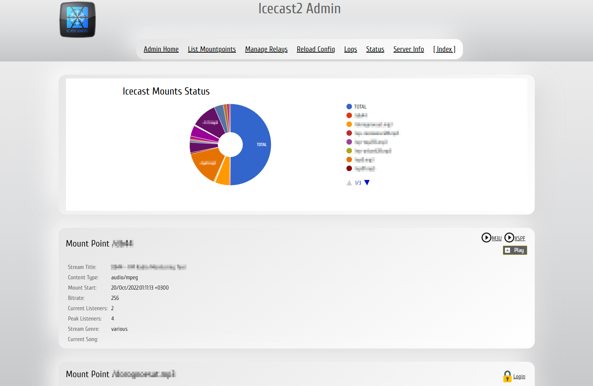

# Icecast-kh Customize
 
Customization pack for [Icecast-kh](https://github.com/karlheyes/icecast-kh) 2.4.0 and newer.

## Visual changes:

- Light backgound, modern font and icons.

- Simple pie-chart for visual evaluation of connected clients

- Expanded Admin Mode menu

- List Mountpoints page shows connected clients: IP-address is now Whois'able, time format HH:MM:SS instead of plain seconds.

- Correct links on Status page

## Installation:

- Make backup of original content in icecast/admin and icecast/web folders

- Download and exract this repository, overwrite content of original folders.

- Enjoy!

## Additional:

- Logrotate and init.d scripts for Icecast-kh

[![BuyMeCoffee][buymecoffeebadge]][buymecoffee]

[buymecoffee]: https://www.buymeacoffee.com/twelve
[buymecoffeebadge]: https://img.shields.io/badge/buy%20me%20a%20coffee-donate-blue.svg?style=for-the-badge
